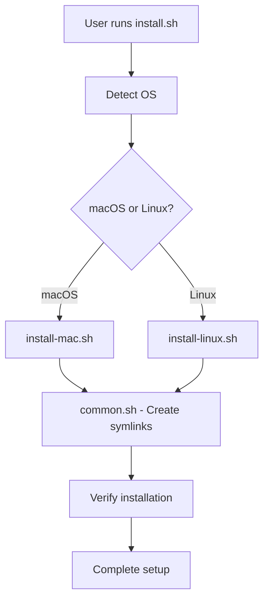
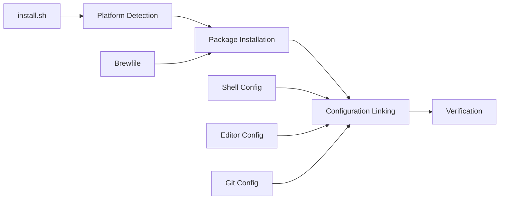

# Design Document

## Overview

The dotfiles deployment system provides a single-command installation that transforms a fresh macOS or Linux machine into a fully configured development environment. The design emphasizes reliability, cross-platform consistency, and AI-friendly terminal output while maintaining the exact setup from the current machine.

## Architecture

### High-Level Flow



### Component Architecture



## Components and Interfaces

### 1. Main Installation Script (install.sh)

**Purpose**: Entry point that orchestrates the entire installation process

**Key Functions**:

- OS detection using `$OSTYPE` and file system checks
- Repository cloning/updating to `~/.dotfiles`
- Platform-specific installer delegation
- Error handling and user feedback

**Interface**:

```bash
# Usage
curl -fsSL https://raw.githubusercontent.com/akgoode/dotfiles/main/install.sh | bash
# OR
git clone <repo> ~/.dotfiles && cd ~/.dotfiles && ./install.sh
```

### 2. Platform-Specific Installers

#### macOS Installer (scripts/install-mac.sh)

**Purpose**: Install packages using Homebrew and handle macOS-specific setup

**Key Functions**:

- Homebrew installation if missing
- Package installation via Brewfile
- NVM and Node.js LTS setup
- macOS-specific path handling

**Dependencies**: Brewfile, internet connection

#### Linux Installer (scripts/install-linux.sh)

**Purpose**: Install packages using apt and manual downloads for latest versions

**Key Functions**:

- Architecture detection (x86_64/aarch64)
- System package installation via apt
- Manual installation of latest versions (Go, Terraform, AWS CLI, kubectl)
- NVM and Node.js setup

**Dependencies**: Ubuntu/Debian system, sudo access, internet connection

### 3. Common Configuration Setup (scripts/common.sh)

**Purpose**: Create symlinks and configure cross-platform settings

**Key Functions**:

- Backup existing configuration files
- Create symbolic links from `~/.dotfiles` to home directory
- Platform-specific path handling for VS Code
- VS Code extension installation
- Default shell configuration

**Backup Strategy**:

- Existing files → `<filename>.backup`
- Existing symlinks → removed and replaced
- Directories → backed up before replacement

### 4. Configuration Files

#### Shell Configuration

**Files**:

- `shell/zshrc` - Main zsh configuration with custom prompt
- `shell/aliases.zsh` - Git and development aliases

**Custom Prompt Design**:

```zsh
# Current implementation uses vcs_info for git integration
# Format: ~/path/to/dir branch_name ❯
# Colors: cyan for path, green for branch, green/red for prompt based on exit status
```

**Key Features**:

- Clean ANSI output (AI-friendly)
- Git branch display without fancy Unicode
- oh-my-zsh compatible aliases
- NVM integration
- Environment variable setup

#### Editor Configurations

**Neovim** (`editors/nvim/`):

- Lazy.nvim plugin manager
- LSP support for multiple languages
- Telescope, Treesitter, debugging support
- Consistent keybindings

**VS Code** (`editors/vscode/`):

- Settings for consistent behavior
- Extension list for automatic installation
- Cross-platform compatibility

**Kiro** (`editors/kiro/settings/mcp.json`):

- MCP server configurations
- AI assistant integration settings

#### Git Configuration (`git/gitconfig`)

**Features**:

- Sensible defaults (rebase on pull, prune on fetch)
- Useful aliases matching shell aliases
- Cross-platform compatibility
- User information placeholders

## Data Models

### Installation State

```typescript
interface InstallationState {
  platform: "darwin" | "linux";
  architecture: "x86_64" | "aarch64" | "arm64";
  dotfilesDir: string;
  backupFiles: string[];
  installedPackages: string[];
  createdSymlinks: SymlinkMapping[];
  errors: InstallationError[];
}

interface SymlinkMapping {
  source: string; // Path in dotfiles repo
  target: string; // Path in home directory
  backed_up: boolean; // Whether original was backed up
}

interface InstallationError {
  component: string; // Which installer/component failed
  message: string; // Error description
  recoverable: boolean; // Whether error can be retried
}
```

### Package Definitions

```typescript
interface PackageSet {
  cli_tools: string[]; // Core CLI utilities
  development_tools: string[]; // Language runtimes and dev tools
  gui_applications?: string[]; // macOS GUI apps (Homebrew casks)
  manual_installs: ManualInstall[]; // Tools requiring manual download
}

interface ManualInstall {
  name: string;
  version: string;
  download_url_template: string; // With {arch} placeholder
  install_method: "tar" | "zip" | "installer";
  verify_command: string;
}
```

## Correctness Properties

_A property is a characteristic or behavior that should hold true across all valid executions of a system-essentially, a formal statement about what the system should do. Properties serve as the bridge between human-readable specifications and machine-verifiable correctness guarantees._

### Property 1: Installation Idempotency

_For any_ system state, running the installation script multiple times should result in the same final configuration without errors or data loss
**Validates: Requirements 6.4, 6.5**

### Property 2: Backup Preservation

_For any_ existing configuration file, if it exists before installation, it should be preserved as a .backup file and the new configuration should be properly linked
**Validates: Requirements 1.5, 6.1**

### Property 3: Complete Tool Installation

_For any_ tool specified in the package definitions (CLI tools, development tools, Node.js via NVM), after successful installation it should be available in the system PATH and functional
**Validates: Requirements 2.1, 2.2, 2.3, 2.5**

### Property 4: Cross-Platform Consistency

_For any_ configuration file, alias, or tool behavior, it should provide identical functionality on both macOS and Linux platforms after installation
**Validates: Requirements 5.1, 5.2, 5.3, 5.4**

### Property 5: Shell Configuration Correctness

_For any_ fresh shell session after installation, the zsh configuration should load without errors, provide all expected git aliases, and display a clean AI-friendly prompt with git information
**Validates: Requirements 3.1, 3.2, 3.3, 3.4, 3.5**

### Property 6: Symlink and Configuration Integrity

_For any_ configuration file in the dotfiles repository, after installation it should be accessible from its expected location in the home directory via symbolic link, and existing files should be handled gracefully
**Validates: Requirements 6.2, 5.3**

### Property 7: Editor Configuration Completeness

_For any_ configured editor (Neovim, VS Code, Kiro), after installation all expected plugins, extensions, and settings should be properly installed and functional
**Validates: Requirements 4.1, 4.2, 4.3, 4.4**

### Property 8: Error Handling and Recovery

_For any_ installation failure scenario, the system should provide clear error messages, leave the system in a recoverable state, and support safe rollback operations
**Validates: Requirements 1.4, 6.3**

## Error Handling

### Error Categories

1. **Network Errors**: Package download failures, repository clone issues

   - Retry mechanism with exponential backoff
   - Clear error messages with manual recovery steps

2. **Permission Errors**: Insufficient privileges for system changes

   - Detect sudo requirements early
   - Provide clear instructions for manual intervention

3. **Dependency Errors**: Missing system requirements

   - Pre-flight checks for essential tools
   - Graceful degradation where possible

4. **Configuration Conflicts**: Existing files that can't be backed up
   - Interactive prompts for conflict resolution
   - Safe defaults that preserve user data

### Recovery Mechanisms

```bash
# Rollback function for common.sh
rollback_installation() {
    echo "Rolling back installation..."
    for backup in ~/.zshrc.backup ~/.gitconfig.backup; do
        if [ -f "$backup" ]; then
            original="${backup%.backup}"
            mv "$backup" "$original"
            echo "Restored $original"
        fi
    done
}
```

## Testing Strategy

### Unit Testing Approach

**Test Categories**:

- **Backup and symlink creation**: Verify files are properly backed up and linked
- **Platform detection**: Test OS and architecture detection logic
- **Error handling**: Verify graceful failure and recovery mechanisms
- **Configuration parsing**: Test that all config files are valid and loadable

**Example Unit Tests**:

```bash
# Test backup functionality
test_backup_existing_file() {
    echo "test content" > ~/.zshrc
    backup_and_link "$DOTFILES_DIR/shell/zshrc" ~/.zshrc
    assert_file_exists ~/.zshrc.backup
    assert_file_content ~/.zshrc.backup "test content"
}

# Test symlink creation
test_symlink_creation() {
    backup_and_link "$DOTFILES_DIR/shell/zshrc" ~/.zshrc
    assert_symlink ~/.zshrc "$DOTFILES_DIR/shell/zshrc"
}
```

### Property-Based Testing Approach

**Property Test Configuration**:

- Minimum 100 iterations per property test
- Use Docker containers for isolated testing environments
- Test across multiple OS configurations

**Property Test Examples**:

```bash
# Property 1: Installation Idempotency
test_installation_idempotency() {
    # Generate random initial system state
    # Run installation twice
    # Verify identical final state
}

# Property 4: Tool Availability
test_tool_availability() {
    # For each tool in package list
    # Verify command exists and is executable
    # Verify version can be queried
}
```

**Testing Framework**: Use bash testing framework (bats-core) for shell script testing

**Test Execution**:

- Each property test runs minimum 100 iterations
- Tests tagged with: **Feature: dotfiles-deployment, Property N: [property_text]**
- Both unit and property tests required for comprehensive coverage

### Integration Testing

**Docker-Based Testing**:

- Ubuntu 24.04 container for Linux testing
- macOS testing on actual hardware (GitHub Actions)
- Test complete installation flow from fresh system
- Verify all tools and configurations work correctly

**Test Scenarios**:

- Fresh installation on clean system
- Installation over existing dotfiles
- Installation with conflicting configurations
- Network failure recovery
- Partial installation recovery
